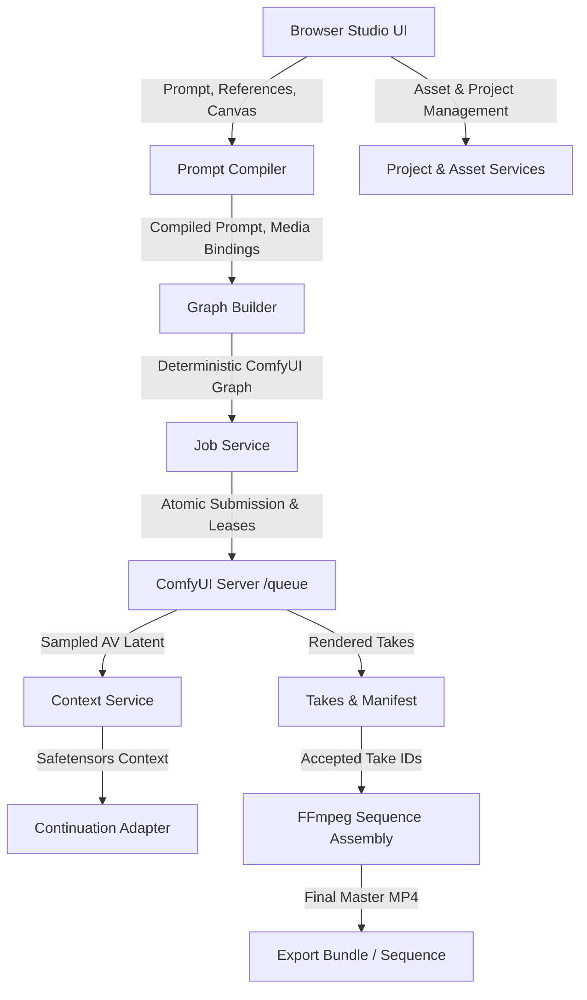

# H3 Studio Lab — Architecture Specification

## Overview

The H3 Studio Lab (`minimax-h3-higgsfield-lab`) extends the production MiniMax H3 video generation workflow with:
1. **Neutral Custom Reference Controls** and deterministic prompt compilation.
2. **Native Temporal Guides** via `MiniMaxH3AddGuide`.
3. **Durable Server Projects and Takes** with optimistic concurrency (`revision` check) and lease-protected asset ownership.
4. **AV Latent Continuation** with exact frame/sample timing (17k+5 frames, 51k+39 context length, 40Hz audio latents).
5. **Decoupled Sequence Assembly** using FFmpeg single-pass AAC muxing without cumulative audio delays.
6. **Zero-Download Qwen-to-H3 Handoff** for start frames and references.

All changes are strictly isolated from production: namespaced under `/h3_studio/lab/*` routes, using server-namespaced storage keys, and keeping production repositories/servers untouched.

---

## Data Flow & Architecture



---

## Canonical Data Contracts

### 1. Project Manifest (`schema_version: 1`)
Stored atomically under `<storage_root>/projects/<project_id>/manifest.json`:
```json
{
  "schema_version": 1,
  "project_id": "8f3b2a1c-...",
  "name": "Project Name",
  "revision": 2,
  "created_at": 1727913600.0,
  "updated_at": 1727914000.0,
  "fps": 24,
  "canvas": {"width": 1280, "height": 704},
  "assets": [
    {
      "asset_id": "asset_4a1b...",
      "kind": "image",
      "path": "assets/asset_4a1b...png",
      "original_name": "character.png",
      "hash": "e3b0c44298fc1c149afbf4c8996fb92427ae41e4649b934ca495991b7852b855",
      "size": 1048576,
      "metadata": {"width": 1280, "height": 704}
    }
  ],
  "clips": [
    {
      "clip_id": "clip_01",
      "prompt": "A character walking in a neon street.",
      "prompt_mode": "guided",
      "references": [{"asset_id": "asset_4a1b...", "alias": "hero", "kind": "image", "role": "custom"}]
    }
  ],
  "takes": [
    {
      "take_id": "take_99f2...",
      "clip_id": "clip_01",
      "output_file": "video/h3_studio_99f2...mp4",
      "effective_settings": {"frames": 175, "steps": 20, "seed": 42},
      "created_at": 1727913800.0,
      "status": "completed"
    }
  ],
  "accepted_take_ids": ["take_99f2..."],
  "exports": []
}
```

### 2. Job Record & Asset Leases
Before submitting to ComfyUI, the job service persists:
- `job_id`: Unique server-assigned identifier.
- `request_id`: Client-supplied idempotency key (prevents duplicate submission).
- `asset_leases`: List of `asset_id` or filename leases. Any asset with an active lease is protected from garbage collection, stale sweeping, and cleanup.
- `state`: Distinct states: `draft`, `validating`, `uploading`, `queued`, `loading`, `sampling`, `decoding`, `saving`, `completed`, `cancel_requested`, `cancelled`, `failed`, `unknown`.

### 3. Continuation Context Specification
Saved as non-pickle `safetensors` with embedded JSON metadata:
- Video Latent Shape: `[1, 16, T_latent, H_latent, W_latent]`
- Audio Latent Shape: `[1, C_audio, T_audio_latent]` (40Hz sampling)
- Fingerprint: Hash of `{model, vae, canvas, fps, frame_count, producer_take_id}`
- Invariant: A context is loaded only when fingerprint and shapes match. Mismatched shapes trigger an actionable error rather than blind tensor padding.

---

## Media & Timing Invariants

1. **Native Video Frame Grid**: `5 + 17 * k`
   - Common lengths: 124, 141, 158, 175, 192, ..., 362 frames.
2. **Context Overlap Grid**: `39 + 51 * k`
   - Default overlap: 39 frames (1.625s at 24 fps).
   - Audio latent ticks for 39 frames: `round(1.625 * 40) = 65` ticks.
   - Feathering window: 8 audio ticks.
3. **Exact Sequence Continuity**:
   - Initial Clip: 175 frames (7.292s)
   - Extension 1: 175 target window - 39 context = +136 unique frames
   - Extension 2: 175 target window - 39 context = +136 unique frames
   - Total Sequence: `175 + 136 + 136 = 447 frames` (18.625s).
4. **AAC Delay Protection**:
   - Canonical PCM audio streams are trimmed at absolute sample boundaries (`sample_rate * frames / 24`).
   - Sequence concatenation occurs at raw PCM level, followed by a single AAC encode in FFmpeg to prevent compound priming delays.
